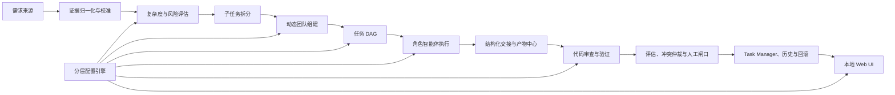

# HIS Harness 可配置动态多智能体平台设计

## 文档状态

- 日期：2026-07-10
- 当前 Harness 版本：v0.33
- 状态：设计已分段确认，等待用户整体审阅
- 实施原则：新增能力默认关闭，不改变现有 CLI、Task Manager、静态 HTML 工作台和业务仓库行为

## 1. 背景

HIS Harness 当前已经具备需求证据归一化、需求理解确认卡、专家串行分析、受控 worktree、提交前验证、Task Manager、修改历史、回滚 dry-run、只读 HTML 工作台，以及 v0.22-v0.33 的配置摘要、草案、回读和审查能力。

当前专家流程仍是固定串行工作流：所有步骤共享同一 LLM 客户端，按固定顺序执行，并把前序文本作为后序上下文。它能够提供多角色视角，但还不是真正的动态多智能体系统。现状缺少：

- 根据需求复杂度和风险动态组建团队。
- 把大需求拆成可独立跟踪、验证和回滚的子任务。
- 独立的角色上下文、模型、工具权限、预算和超时。
- 可并行执行的任务 DAG、依赖关系和文件路径冲突控制。
- 产品、架构、开发、审查、测试之间的结构化交接契约。
- 产物版本、过期传播、冲突仲裁和人工闸口。
- 可实际应用但不泄露密钥的分层配置引擎。
- 面向个人和团队分发的本地 Web UI。

本设计在不影响当前 Harness 正常使用的前提下，将其演进为可配置、可解释、可审计、可恢复的动态多智能体研发控制层。

## 2. 目标与非目标

### 2.1 目标

1. 简单需求使用最小团队，中大型或高风险需求自动升级团队和治理强度。
2. 大需求拆成可独立开发、验证、审查、重试和回滚的 Task Manager 子任务。
3. 每个智能体拥有明确职责、输入契约、输出契约、模型、权限、预算和失败策略。
4. 通过 DAG 支持安全并行，避免不同智能体同时修改相同路径。
5. 所有规则、提交规范、评论模板、状态流转、模型、角色、验证方式和项目映射尽可能配置化。
6. 团队配置可分发，个人密钥和本地路径不进入团队包。
7. 提供可操作的本地 Web UI，覆盖任务、运行、配置、凭证状态、团队模板、历史和诊断。
8. 所有执行都可追踪、可解释、可恢复；代码回滚默认先生成 dry-run 计划。
9. 保留 legacy 固定工作流，任何新阶段都可通过 Feature Flag 回退。

### 2.2 非目标

- 本设计不建设公网 SaaS 或中心化托管平台。
- 本设计不默认开放云效、TAPD、Git 远端、发布和部署写入。
- 本设计不把静态代码检查或模型判断描述为真实业务验收通过。
- 本设计不保存 API Key、密码、Cookie、浏览器登录态正文到团队包或任务数据库。
- 本设计不允许开发智能体自行批准自己的代码。
- 本设计不在第一阶段替换现有 HarnessRunner、Task Manager 或旧配置文件。

## 3. 核心设计原则

1. **兼容优先**：未启用新功能时，输出、命令和执行行为保持当前 v0.33 语义。
2. **安全默认**：所有外部写入、自动提交、自动推送、自动回滚执行默认关闭。
3. **证据优先**：用户明确指令高于需求平台内容；可信需求证据高于模型推断。
4. **契约交接**：智能体之间传递结构化产物，不依赖无限增长的聊天文本。
5. **最小权限**：每个节点只获得完成当前任务所需的模型、工具和路径权限。
6. **可解释决策**：复杂度、团队组建、任务拆分、重试和阻断都记录原因与规则来源。
7. **独立可恢复**：失败从节点检查点恢复，不无条件重跑完整需求。
8. **不可变运行快照**：一次运行使用固定 `ResolvedConfig`，中途修改配置只影响后续运行。
9. **人机分界明确**：高风险业务语义、真实验收和外部写动作必须保留人工闸口。

## 4. 总体架构



系统由六个清晰边界组成：

1. **Requirement Plane**：接入云效、TAPD、文件和手工需求，只读归一化证据。
2. **Planning Plane**：复杂度评分、风险升级、子任务拆分和团队组建。
3. **Execution Plane**：DAG 调度、智能体运行、worktree 隔离和工具权限。
4. **Governance Plane**：契约校验、审查、验证、冲突仲裁和人工闸口。
5. **Configuration Plane**：分层配置、凭证引用、团队包和配置审计。
6. **Experience Plane**：Task Manager、本地 Web UI、历史、诊断和回滚预览。

这些平面通过版本化数据契约交互，内部实现可以独立演进。

## 5. 运行模式

### 5.1 Legacy 模式

继续执行 `prompts/default_experts.json` 定义的固定串行步骤。默认配置、旧命令和未传新参数的 Task Manager 均进入此模式。

### 5.2 Dynamic Plan 模式

执行需求校准、复杂度评分、任务拆分、团队组建和 DAG 生成，但不调用开发工具、不修改代码。用于先验证新编排结果。

### 5.3 Dynamic Execute 模式

在受控 worktree 中执行 DAG，允许开发、审查和验证节点运行。补丁应用、提交和远端动作仍由独立权限控制。

### 5.4 模式选择

运行模式按以下优先级确定：

1. 用户本次运行显式参数。
2. 项目配置。
3. 团队配置。
4. 内置默认值 `legacy`。

硬安全规则可以把请求降级为更保守模式，但不能被低层配置升级绕过。

## 6. 复杂度与风险评估

### 6.1 可解释评分

评分器只使用可记录的特征，不直接让模型输出一个不可解释等级。每项都保存数值、证据和来源：

| 维度 | 示例 |
|---|---|
| 业务范围 | 单页面、跨模块、跨系统 |
| 技术范围 | 前端、后端、数据库、报表、接口组合 |
| 改动范围 | 文件数、仓库数、预计接口数 |
| 依赖复杂度 | 无依赖、串行依赖、并行分支、外部系统 |
| 业务风险 | 普通、收费、退费、结算、医保、对账、政策校验 |
| 证据完整性 | 明确、部分缺失、关键语义冲突 |
| 验证难度 | 单元测试、集成测试、登录态 UI、真实测试数据 |
| 可回滚性 | 单补丁、跨仓库、数据库迁移、不可逆外部动作 |

每个维度按 `0-3` 分计分，八个维度总分为 `0-24`。默认等级：

- `simple`，`0-5` 分：范围小、证据充分、单仓库、低风险、可独立验证。
- `medium`，`6-11` 分：跨层或多文件，有明确依赖，需要架构与独立审查。
- `large`，`12-24` 分：多仓库、多模块、多子目标，可拆成并行子任务。
- `high_risk`：触发高风险业务或存在不可逆影响，不受普通分数降级。

维度分值和阈值允许团队配置调整，但系统强制升级规则不可关闭。评分规则版本写入 `ComplexityAssessment`，保证历史运行可以复现当时结论。

### 6.2 强制升级规则

满足任意一项即升级为 `high_risk` 或进入人工确认：

- 医保、收费、退费、结算、对账、金额舍入、政策校验核心逻辑。
- 数据库结构迁移、批量历史数据修复或不可逆脚本。
- 真实外部写入、自动提交推送、发布或部署。
- 用户说明与可信需求证据冲突且会改变业务语义。
- 字段来源、接口契约或验收口径无法从证据证明。
- 多智能体可能同时修改相同文件或同一业务分支。

### 6.3 评分输出

评分器生成 `ComplexityAssessment`，包含：等级、总分、各维度、强制升级规则、证据引用、推荐团队、推荐工作流、人工确认项和配置来源。

## 7. 子任务拆分与 DAG

### 7.1 拆分原则

子任务必须是可独立跟踪的交付物，同时满足：

- 有明确输入和完成条件。
- 有独立允许修改路径。
- 有独立验证方式。
- 能产生明确交接产物。
- 失败可单独重试。
- 代码变更可单独回滚，或明确声明必须与其他子任务原子合并。

优先按业务能力和可验证交付物拆分，不按“一个智能体一个任务”机械拆分。例如，前端筛选控件和后端筛选接口若必须一起验收，可以是两个有契约依赖的子任务，而不是两个完全孤立任务。

### 7.2 依赖类型

- `requires`：前置节点成功后才能开始。
- `consumes`：读取指定版本产物；产物更新后当前节点变为过期。
- `validates`：验证目标节点输出。
- `reviews`：独立审查目标节点输出。
- `blocks`：未完成前禁止指定动作。
- `atomic_with`：必须作为一个原子变更集合应用或回滚。

### 7.3 节点状态

```text
planned -> ready -> running -> succeeded
                    |           |
                    |           -> stale
                    -> retrying -> failed -> blocked
planned/ready/running -> cancelled
```

`succeeded` 只表示节点契约满足，不自动等于整个需求验收通过。

### 7.4 并发与路径锁

调度器在运行前计算每个开发节点的 `allowed_paths`：

- 路径集合无交集且依赖满足时可以并行。
- 路径集合有交集时默认串行。
- 动态发现白名单外文件时立即暂停节点，不自动扩大权限。
- 多仓库任务按仓库创建独立 worktree。
- `atomic_with` 节点在全部验证通过后才能统一进入补丁应用阶段。

### 7.5 Task Manager 映射

一个外部需求对应一个父任务；每个可独立交付物对应一个子任务。父任务保存总体需求、校准卡、复杂度评估和总体验收，子任务保存独立 run、产物、代码差异、验证和回滚记录。

## 8. 动态团队

### 8.1 预设团队

| 级别 | 默认角色 |
|---|---|
| simple | 需求分析、开发、验证 |
| medium | 产品、架构、开发、代码审查、测试 |
| large | 产品、架构、前端/后端/数据库按需开发、代码审查、测试设计、测试执行、验收 |
| high_risk | large 全部角色、高风险审查、冲突仲裁、人工闸口 |

团队组建不是固定角色堆叠。评分器和任务拆分结果决定是否启用前端、后端、数据库、报表、测试执行或高风险审查。用户可以在 Web UI 或本次运行参数中增加角色；删除安全强制角色会被拒绝。

### 8.2 角色目录

| 角色 | 核心职责 | 不允许做的事 |
|---|---|---|
| Harness Orchestrator | 解析配置、调度 DAG、维护状态 | 修改业务代码、替代人工批准 |
| Product Analyst | 形成需求契约和验收边界 | 猜测字段来源 |
| Architect | 拆分模块、接口、依赖和风险 | 自行批准实现 |
| Frontend Developer | 在前端白名单内实现和自测 | 修改未授权后端路径 |
| Backend Developer | 在后端白名单内实现和自测 | 修改未授权数据库结构 |
| Database/Report Specialist | SQL、数据口径、报表影响 | 执行不可逆生产脚本 |
| High-risk Reviewer | 审查敏感业务语义和兼容路径 | 代替业务人员验收 |
| Code Reviewer | 独立代码审查和风险判断 | 审批自己的实现 |
| Test Designer | 设计自动与人工验收矩阵 | 伪造执行结果 |
| Test Executor | 执行允许的验证命令并收集证据 | 无权限扩大测试范围 |
| Acceptance Agent | 汇总契约、证据和残余风险 | 把静态检查等同真实验收 |
| Conflict Arbiter | 依据优先级裁定冲突或升级人工 | 在证据不足时猜测裁定 |

### 8.3 智能体运行配置

每个角色可配置：

- 默认模型与备用模型。
- 系统提示词和结构化输出 schema。
- 可用工具和禁止工具。
- 可读目录和可写白名单。
- 最大输入、输出和费用预算。
- 超时、重试次数和退避策略。
- 是否允许并行。
- 必需上游契约和输出契约。
- 是否需要独立审查或人工确认。

## 9. 结构化交接契约

### 9.1 通用信封

所有契约共享以下元数据：

```json
{
  "schema_name": "RequirementContract",
  "schema_version": "1.0",
  "artifact_id": "artifact-...",
  "artifact_version": 1,
  "task_id": "task-...",
  "subtask_id": "subtask-...",
  "run_id": "run-...",
  "producer": "product-analyst",
  "created_at": "ISO-8601",
  "input_artifact_ids": [],
  "content_hash": "sha256:...",
  "config_snapshot_id": "config-...",
  "evidence_refs": [],
  "warnings": [],
  "blockers": []
}
```

### 9.2 核心契约

- `RequirementContract`：业务目标、范围、排除项、字段/参数、来源优先级、验收标准、待确认项。
- `ArchitectureContract`：模块边界、接口契约、数据流、依赖、兼容策略、风险和回滚策略。
- `SubtaskSpec`：输入、输出、依赖、允许路径、验证命令、完成条件和原子关系。
- `ImplementationResult`：实际改动、diff、文件清单、自测、偏离方案说明和残余风险。
- `ReviewDecision`：审查结论、发现、严重级别、证据、是否需返工。
- `VerificationResult`：命令、环境、退出码、日志摘要、基线对比、UI 证据和结论。
- `AcceptanceDecision`：需求条目与证据映射、自动验证、人工验收和最终边界。
- `ConflictCase`：冲突双方、证据、规则优先级、裁决或人工升级原因。

### 9.3 契约规则

- schema 校验失败的产物不能进入下游。
- 上游产物版本变化后，消费旧版本的下游节点标记 `stale`。
- 开发节点不能生成有效的自我 `ReviewDecision`。
- 任何结论必须引用产物、代码、命令或需求证据；纯模型推断必须标记为推断。
- 冲突优先级固定为：用户明确指令 > 可信需求证据 > 代码/API/数据库证据 > 团队规则 > 模型推断。

## 10. 编排与恢复

### 10.1 调度流程

```text
解析 ResolvedConfig
-> 读取并校准需求
-> 复杂度与风险评估
-> 生成父任务和子任务
-> 组建动态团队
-> 构建并校验 DAG
-> 分配权限、预算和 worktree
-> 执行 ready 节点
-> 校验交接产物
-> 审查和验证
-> 仲裁冲突或进入人工闸口
-> 汇总验收边界
-> 登记历史与回滚信息
```

### 10.2 检查点

节点在以下时刻写检查点：开始前、工具调用后、产物生成后、验证后和状态转换后。检查点只保存恢复所需状态，敏感工具输出先脱敏。进程异常退出且原 run 尚未进入终态时，可以恢复同一个 run；原 run 已经是 `failed` 或 `cancelled` 时，恢复操作必须创建新 run，并记录 `resumed_from_run_id` 和 `checkpoint_id`，不得改写原运行结论。

### 10.3 失败策略

失败按以下顺序处理：

1. 保存日志、工具调用摘要和中间产物。
2. 判断错误是否可重试。
3. 在预算内按节点策略重试。
4. 配置允许时切换备用模型。
5. 输入契约失效时回到最近有效上游节点重新规划。
6. 仍失败则阻塞子任务并说明人工处理条件。

取消操作不会删除产物；运行标记为 `cancelled`，已生成的未验证代码不得应用。

## 11. 分层配置引擎

### 11.1 配置层级

普通配置从低到高依次为：

1. `builtin_defaults`：随 Harness 发布的默认配置。
2. `team_package`：团队共享规则、角色、工作流和模板。
3. `project_config`：业务项目特定路径、分支、验证和 Provider 映射。
4. `personal_override`：个人模型选择、凭证引用和本地路径。
5. `run_override`：当前运行的一次性参数。

`system_hard_guards` 不参与普通优先级竞争，而是在合并前校验受保护配置路径，并在合并后执行最终安全裁决。任何普通配置层都不能覆盖 hard guard。配置解析后生成不可变 `ResolvedConfig` 快照；运行中修改配置只影响新运行。

### 11.2 配置领域

- `providers`：云效、TAPD、文件、手工输入等来源适配器。
- `agents`：角色、提示词、模型、工具、预算、超时、重试。
- `orchestration`：复杂度规则、团队预设、DAG、并发和人工闸口。
- `git`：分支、提交规范、允许动作和提交前门禁。
- `comments`：需求评论模板和字段组成。
- `status_flow`：状态映射、允许转换和确认要求。
- `verification`：项目命令、方法测试、UI 证据和验收策略。
- `risk`：业务风险分类、强制升级和敏感路径。
- `projects`：仓库、模块、路径、分支和验证配置。
- `models`：Provider、模型别名、能力、限额和备用策略。
- `credentials`：凭证引用和用途，不保存密钥正文。
- `workspace_ui`：页面可见性、默认筛选和只读/操作模式。
- `storage`：Task Manager、产物、历史和保留策略。
- `history`：快照、审计和回滚策略。
- `features`：分阶段启用开关。

### 11.3 合并策略

每个配置路径显式声明一种策略：

- `replace`：高优先级完整替换。
- `merge`：对象按键递归合并。
- `append`：列表追加并保留顺序。
- `union`：列表去重合并。
- `remove`：显式删除允许删除的条目。
- `locked`：低层不可修改。

数组默认不做猜测性合并。未声明策略的数组使用 `replace`，避免角色、状态流转或命令被意外叠加。

### 11.4 来源追踪

`ResolvedConfig` 对每个最终值记录：值、来源层、来源文件、配置路径、合并策略、是否锁定、覆盖链和脱敏状态。Web UI 可以回答“当前为什么是这个值”。

### 11.5 配置应用流程

```text
草案 -> schema 校验 -> 安全校验 -> 差异预览
-> 选择写入层 -> 自动备份 -> 原子写入 -> 回读校验 -> 审计记录
```

任何一步失败都保留原文件。个人层只写用户明确选择的目录；团队层只写明确选择的团队包目录。

## 12. 团队配置包

标准团队包结构：

```text
harness-team-package/
├── manifest.json
├── rule-pack.json
├── agents.json
├── workflows.json
├── providers.json
├── projects.example.json
├── verification.json
├── ui.json
├── credentials.example.json
└── CHANGELOG.md
```

### 12.1 Manifest

记录包 ID、版本、schema 版本、兼容 Harness 版本、文件校验和、维护者、变更摘要和可选签名信息。

### 12.2 分发位置

团队包可以保存在独立 Git 仓库、业务项目内的受控目录或用户选择的共享目录。默认只支持本地文件和 Git 获取，不引入中心服务。

### 12.3 分享校验

导出或分发前必须检查：密钥正文、Token、Cookie、个人用户名、个人绝对路径、业务数据样本、浏览器状态文件和超大产物。发现高风险内容时阻断导出。

## 13. 凭证模型

支持以下引用：

- `env:OPENAI_API_KEY`
- `keychain:his-harness/openai`
- `file:/local/private/credentials.json#openai_api_key`

规则：

- 数据库和配置只保存引用。
- Web UI 只展示“已配置/缺失”、来源类型、更新时间和可选脱敏尾号。
- Web UI 不提供读取完整密钥功能，只允许替换或删除引用。
- 团队包只能包含 `credentials.example.json`。
- 连接测试必须由用户显式触发，默认使用只读、最小权限操作。
- 日志、异常、导出和模型上下文必须经过密钥模式脱敏。
- 现有 legacy 凭证文件通过适配器兼容，但新配置不得硬编码个人绝对路径。

## 14. Web UI

### 14.1 产品定位

Web UI 是本地研发工作台，不是营销页面。界面以安静、紧凑、易扫描和重复操作效率为主；第一屏直接进入任务和运行状态。

### 14.2 导航

```text
HIS Harness
├── 总览
├── 需求与任务
├── 运行记录
├── 配置中心
├── 智能体与工作流
├── Provider 与凭证
├── 团队模板
├── 审计历史
└── 系统诊断
```

### 14.3 总览

展示待确认、阻塞、运行中、验证失败、高风险和证据缺失任务；显示最近运行、费用/Token 预算摘要、配置错误和系统诊断。总览不使用装饰性大卡片，而使用紧凑状态区、表格和筛选。

### 14.4 需求与任务

任务列表支持来源、编号、项目、复杂度、风险、状态、团队、验证状态和更新时间筛选。任务详情包含：

- 需求原文和归一化证据。
- 用户纠正规则和来源优先级。
- 需求校准卡和复杂度评估。
- 父任务、子任务和 DAG。
- 智能体节点状态与交接产物。
- 代码改动、验证、审查和人工验收。
- 修改历史、快照比较和回滚 dry-run。

### 14.5 运行记录

显示实时 DAG、时间线、当前节点、依赖、模型、工具权限、预算、日志摘要和产物。操作按钮按权限显示：暂停、继续、取消、重试失败节点、从检查点恢复和提交人工确认。危险动作必须显示影响范围和确认内容。

### 14.6 配置中心

提供团队、项目、个人和本次运行层切换；同时展示最终生效值、来源、覆盖链和锁定状态。编辑流程固定为草案、校验、差异预览、选择层、备份、应用、回读。配置错误不能影响当前已运行任务。

### 14.7 智能体与工作流

展示角色目录、模型、工具权限、预算、超时、重试、输入输出契约和团队预设。工作流编辑器第一阶段采用表单和依赖表，不要求拖拽画布；DAG 可以只读可视化。用户可增加角色，但不能删除硬规则要求的审查或人工闸口。

### 14.8 Provider 与凭证

Provider 页面展示能力、连接状态、只读/写入权限和最近错误。凭证页面只显示引用状态和脱敏信息，不显示完整密钥。写入能力与读取能力分别配置。

### 14.9 团队模板

展示包版本、兼容性、校验和、变更记录、固定版本、更新差异、导入、导出和回退。导出前执行 secret-free 校验。

### 14.10 审计历史

展示配置修改、任务动作、智能体执行、人工确认、补丁应用和回滚计划。每条记录包含操作者、时间、原因、配置快照、前后差异、结果和关联任务。

### 14.11 系统诊断

检查 Python/Node/浏览器依赖、数据库、目录权限、凭证引用状态、Provider 连接、Worktree 能力、模型能力和配置兼容性。诊断不得自动修复或安装依赖。

### 14.12 UI 状态

每个页面必须定义 loading、空数据、部分数据、错误、离线、只读、无权限和数据过期状态。长任务使用稳定状态区域，动态日志不能导致整体布局跳动。桌面优先，同时保证窄屏下表格可横向滚动、操作不重叠。

## 15. 修改历史与回滚

### 15.1 历史记录

每次配置或代码修改都记录：序号、父任务、子任务、run、操作者、原因、时间、配置快照、输入产物、diff、验证结果和残余风险。

### 15.2 回滚类型

- 配置回滚：恢复指定配置快照，先显示差异并重新校验。
- 代码回滚：生成反向补丁和 `git apply --reverse --check` 结果。
- 任务恢复：从指定 DAG 检查点建立新 run，不覆盖旧 run。
- 团队包回退：固定到历史包版本并生成生效配置差异。

默认只生成回滚计划。真实应用代码回滚必须在独立受控流程中执行，且不能处理未记录或已漂移的工作区。

## 16. 权限、安全与审计

### 16.1 角色权限

预定义 `Owner`、`Admin`、`Developer`、`Reviewer`、`Viewer`。第一阶段本地单用户默认映射为 Owner，但动作仍受硬安全规则和项目策略限制。未来团队部署可替换身份来源，不改变权限判断接口。

### 16.2 三重授权

敏感操作必须同时满足：

1. 用户角色允许。
2. 当前项目作用域允许。
3. 动作策略和人工确认允许。

配置修改、代码写入、补丁应用、Git 提交、Git 推送、需求平台写入和部署是不同权限，不进行隐式继承。

### 16.3 执行隔离

- 所有代码修改在临时 worktree 执行。
- 每个节点有工具和路径白名单。
- 命令有超时、输出上限和资源预算。
- 未授权文件读取和白名单外写入均阻断。
- 验证命令产生工作区副作用时不能作为干净通过。
- 日志落盘前脱敏。

### 16.4 审计

审计事件采用追加写入，不修改历史记录。事件保存动作、主体、目标、策略决定、配置快照、结果和关联证据。高敏内容只保存摘要与哈希。

## 17. 存储模型

在现有 Task Manager 数据结构上增量增加：

- `harness_parent_tasks`：父需求与总体状态。
- `harness_subtasks`：子任务、依赖、路径和验收条件。
- `harness_task_edges`：DAG 边及依赖类型。
- `harness_agent_runs`：角色、模型、预算、权限和状态。
- `harness_artifacts` 扩展：schema、版本、哈希、来源和过期状态。
- `harness_checkpoints`：节点恢复状态。
- `harness_config_snapshots`：不可变生效配置和来源追踪。
- `harness_audit_events`：追加式审计事件。
- `harness_human_gates`：确认内容、状态和确认人。

数据库迁移使用显式 `schema_version`，迁移前备份，失败时保持旧数据库可读。

## 18. Provider 扩展

需求来源统一实现只读 `RequirementProvider` 接口：

```text
identify(url_or_input)
fetch_metadata()
fetch_description()
fetch_comments()
fetch_attachments()
normalize()
health_check()
```

云效、TAPD、Jira、GitHub Issue、文件和手工输入都输出同一 `RequirementEvidence`。Provider 的写动作不属于该接口，必须放在独立 `ExternalActionProvider` 中并单独授权，防止只读接入意外获得写权限。

## 19. 兼容与迁移策略

### 19.1 兼容适配器

- `prompts/default_experts.json` 映射为 legacy workflow 和内置角色定义。
- `config/rule_packs/dfhis.default.json` 映射为 built-in/team 配置输入。
- `config/profiles.example.json` 映射为 Profile 模板。
- legacy 凭证文件映射为个人凭证引用来源。
- Task Manager 旧 run 在 Web UI 中按 legacy run 展示，不强制补造 DAG。

### 19.2 双轨原则

迁移阶段采用“旧路径继续运行、新路径显式启用”。不执行隐式双写；新数据写入新表，必要的旧格式输出由导出适配器生成。确认稳定后才能讨论替换旧路径。

### 19.3 Feature Flags

至少包含：

- `config_resolver_v2`
- `config_apply_local`
- `web_workspace_v2`
- `dynamic_team_planning`
- `dag_execution`
- `agent_worktree_execution`
- `controlled_patch_apply`
- `external_actions`

默认只有只读能力可以逐步开启，所有写入类开关默认关闭。

## 20. 测试策略

### 20.1 单元测试

- 配置优先级、合并策略、锁定规则和来源追踪。
- 复杂度评分和强制升级规则。
- 团队组建、子任务拆分和 DAG 校验。
- 契约 schema、版本、哈希和过期传播。
- 权限判断、凭证脱敏和路径白名单。

### 20.2 契约测试

- 每个角色输入输出契约的有效与无效样例。
- Provider 归一化一致性。
- legacy 数据到新 UI 模型的适配。
- 配置包不同 schema 版本兼容性。

### 20.3 集成测试

- 父任务、子任务、DAG、智能体、产物和 Task Manager 全链路。
- 多 worktree 并发与路径冲突。
- 模型超时、重试、备用模型和预算耗尽。
- 配置草案、差异、备份、原子写入和回读。
- 修改历史、快照比较和回滚 dry-run。

### 20.4 安全测试

- 恶意团队包、路径穿越、命令注入和越权动作。
- 密钥在日志、错误、导出包和模型上下文中的泄露检查。
- 低层配置覆盖 hard guard 的失败用例。
- 开发智能体自我审批和外部写入绕过用例。

### 20.5 Web UI 测试

- 页面加载、空数据、错误、离线、无权限和过期数据。
- 筛选、搜索、详情、历史、差异和复制命令。
- 配置来源、锁定状态、脱敏和危险操作确认。
- 桌面与窄屏布局、文本溢出和表格滚动。

### 20.6 真实样板回放

使用脱敏后的 DFHIS 样板回放 simple、medium、large 和 high-risk 四类流程。样板验证只证明 Harness 编排和门禁行为，不替代真实 HIS 业务验收。

## 21. 分阶段实施

每个阶段都必须通过回归后再启用下一阶段：

1. **v0.34 配置解析器**：只读 `ResolvedConfig`、来源追踪、schema 和兼容适配器。
2. **v0.35 本地配置应用**：草案、校验、差异、备份、原子写入和回读；默认关闭。
3. **v0.36 Web UI 基座**：只读展示现有 Task Manager、配置和诊断。
4. **v0.37 Web UI 任务工作台**：任务详情、run、证据、历史、配置来源和回滚预览。
5. **v0.38 动态规划**：复杂度评分、团队组建、子任务和 DAG dry-run，不改代码。
6. **v0.39 契约与调度器**：版本化交接契约、检查点、重试、过期传播和审计。
7. **v0.40 智能体 Worktree 执行**：独立上下文、模型、工具、预算、路径锁和安全并行。
8. **v0.41 治理闭环**：独立审查、测试执行、冲突仲裁、人工闸口和父任务验收汇总。
9. **v0.42 团队分发**：团队包版本、校验和、导入导出、固定版本和回退。
10. **v0.43 外部动作准备**：只设计和 dry-run Git/需求平台动作；真实写入仍需单独评审授权。

任何阶段失败，关闭对应 Feature Flag 后回到 v0.33 或已稳定阶段。

## 22. 验收标准

设计实施完成的最低标准：

1. 不传新参数时，现有 v0.33 关键命令和自检结果保持兼容。
2. 每次运行都能说明使用了哪些配置值及其来源。
3. simple、medium、large、high-risk 能稳定得到不同且可解释的团队与工作流。
4. 大需求能够形成父任务、子任务、DAG、独立 run 和独立回滚记录。
5. 并行开发不会同时写入重叠路径；冲突能够阻断和说明原因。
6. 每个角色只能使用配置允许的模型、工具、预算和路径。
7. 所有交接产物通过 schema 校验，上游变化能使下游正确过期。
8. Harness 中断后能从有效检查点建立恢复运行。
9. Web UI 能查看任务、运行、证据、配置来源、团队、历史和诊断。
10. 配置应用失败不会破坏原配置，且可以从备份恢复。
11. 团队包不包含个人密钥、登录态或个人绝对路径。
12. 静态检查、自动测试和人工验收边界在报告中明确区分。
13. 外部写入在未单独授权时始终保持关闭。

## 23. 已确定默认决策

- 采用按复杂度动态组建团队，而不是所有需求固定运行全部角色。
- 第一阶段保持本地优先，不建设中心服务。
- 第一阶段 Web UI 为本地单用户工作台，但权限接口按未来团队使用设计。
- 配置采用分层文件和不可变运行快照，不采用单一超大 JSON。
- 团队包可以进入 Git，个人覆盖和凭证引用留在本机。
- 工作流使用 DAG，开发节点通过 worktree 和路径锁隔离。
- 外部需求系统读取与写入使用不同 Provider 接口和权限。
- 回滚默认 dry-run，实际回滚属于单独受控动作。
- 视觉设计阶段默认使用文本信息架构和 Mermaid；仅在用户主动要求时启用可视化辅助。

## 24. 实施前置条件

本设计是平台级总架构规范，不对应一次性实现。整体审阅通过后，只为 v0.34 编写第一份实施计划；v0.35-v0.43 在前一阶段验收通过后分别编写独立实施计划。每份实施计划必须列出：目标文件、迁移方式、测试先行步骤、兼容回归命令、Feature Flag、失败回退方式和完成证据。

真实个人配置目录、团队模板目录和远端只读账号只在对应阶段需要端到端验证时再由用户选择；v0.34 的只读配置解析器和兼容测试不需要提前提供这些信息。
